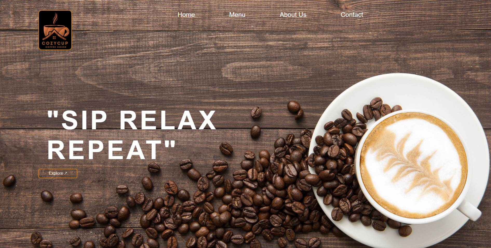
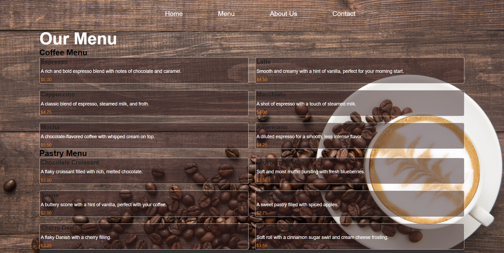
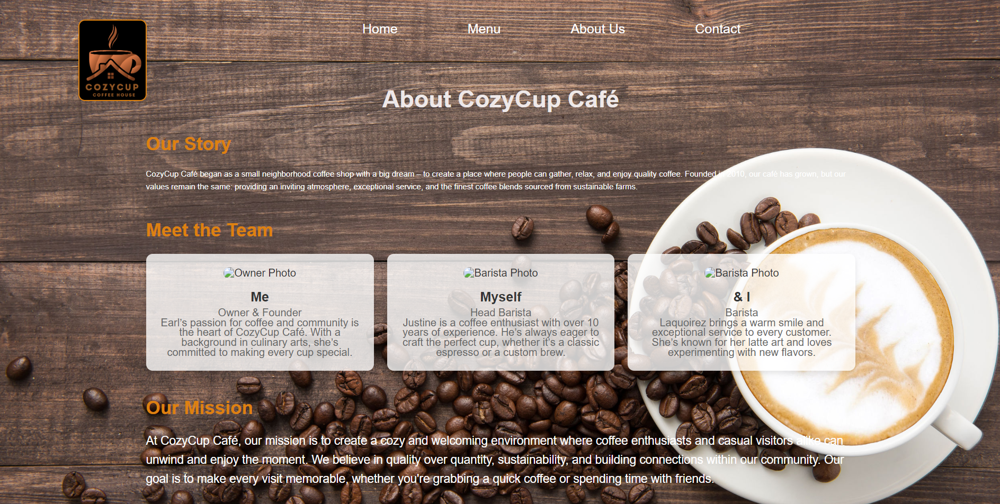
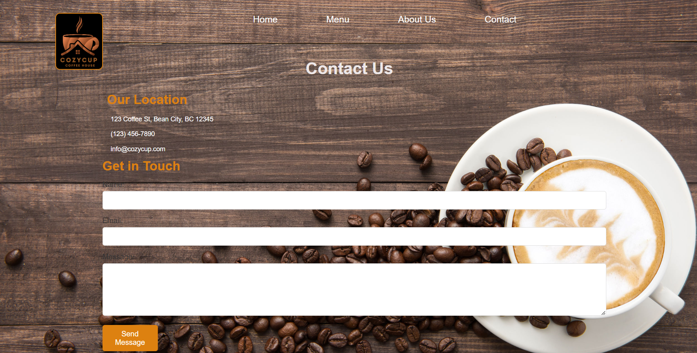

# CozyCup Café

## Project Description
CozyCup Café is a dynamic and interactive website designed to bring the warm and inviting atmosphere of our café online. This project showcases our diverse menu of coffee blends and pastries, provides insights into the café's story, and allows customers to engage with us through a contact form, social media links, and more.

## Features
- **Interactive Menu/Buttons/Links:** Displays our coffee and pastry selections with descriptions and prices, organized in an easy-to-navigate layout.

- **About Us:** Learn about the origins of CozyCup Café, meet our team, and understand our commitment to quality and customer satisfaction.
- **Contact Us:** Get in touch with us through a contact form, view our location on an embedded map, and connect via social media.
- **Featured Products:** Highlighted coffee blends and pastries with images and descriptions.

## Screen Captures

### 1. Home Page

The welcoming home page of CozyCup Café, featuring a warm background and navigation options.

### 2. Menu Page

A detailed view of our menu, showcasing various coffee blends and pastries.

### 3. About Us Page

Learn about the café's origins, meet the team, and explore our mission.

### 4. Contact Us Page

A page where customers can find our contact information, send inquiries, and view our location on a map.

## About the Authors

**Name:** Earl Laquiorez  
**Email:** ejlqrz@gmail.com

### 5. Connect with Us

