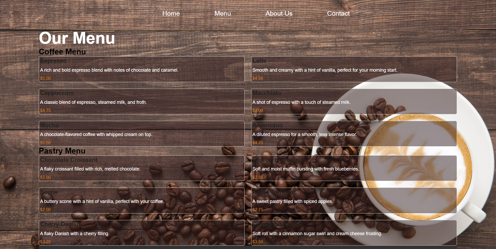
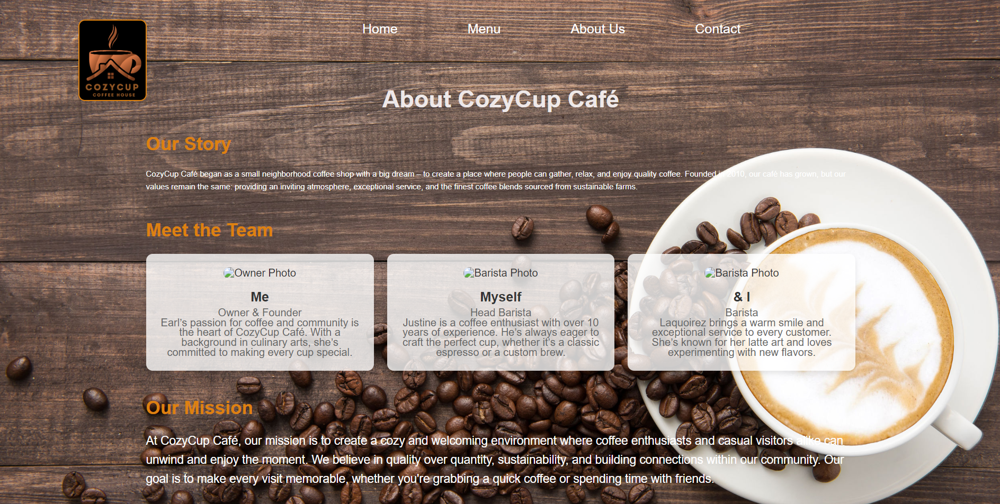
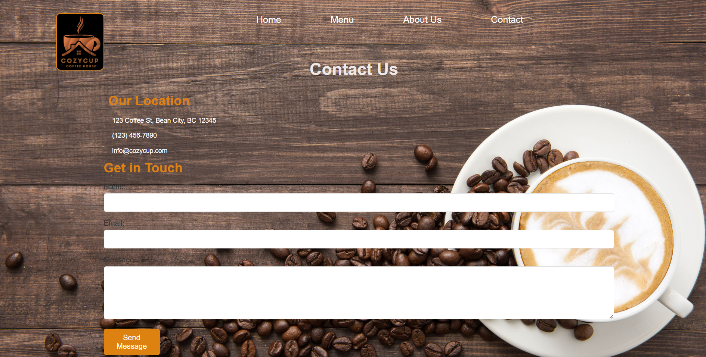

# CozyCup Café

A small static website for a fictional neighborhood café: menu, story, contact, and a hero home page with featured items. The design uses a warm palette, serif + sans typography, and responsive layouts (cards, menu boards, sticky header on inner pages).

## Features

- **Home** — Full-height hero with background image and gradient overlay, featured product grid, newsletter block in the footer.
- **Menu** — Category hero, jump links to coffee vs. pastries, board-style sections with photo cards and clear pricing.
- **About** — Story, team grid, and mission.
- **Contact** — Location details, message form, embedded map, and footer with social links.

## Tech stack

- HTML5 (semantic landmarks: `header`, `main`, `footer`, `section`, `article` where applicable)
- One global stylesheet: [`style.css`](style.css) (CSS custom properties, Grid/Flex, sticky header)
- [Google Fonts](https://fonts.google.com/): Fraunces + DM Sans
- [Font Awesome 6](https://fontawesome.com/) (icons in footer, menu placeholders, etc.)
- No build step or framework—open or serve the files as static assets.

## Project layout

| Path | Purpose |
|------|---------|
| `index.html` | Home |
| `menu.html` | Menu |
| `about.html` | About |
| `contact.html` | Contact + form + map |
| `style.css` | All page styles |
| `images/` | Logo, hero background, product/menu photos, team photos, social icons |

## Run locally

From the project folder, serve over HTTP so fonts and assets load predictably:

```bash
# Python 3
python -m http.server 5500
```

Then open [http://127.0.0.1:5500/](http://127.0.0.1:5500/) (or `index.html`, `menu.html`, etc.).

Alternatively, open any `.html` file directly in the browser via `file://` for a quick check.

## Screenshots

Add exports under `images/` if you want the README to show them (for example `images/home-page.png`, `images/menu-page.png`, `images/about-page.png`, `images/contact-page.png`).

### Home page


### Menu page



### About page



### Contact page



## Author

**Earl Laquiorez**  
Email: [ejlqrz@gmail.com](mailto:ejlqrz@gmail.com)


**Connect**

- [Facebook](https://www.facebook.com/lqrz008)
- [GitHub](https://github.com/EjLaquiorez)
